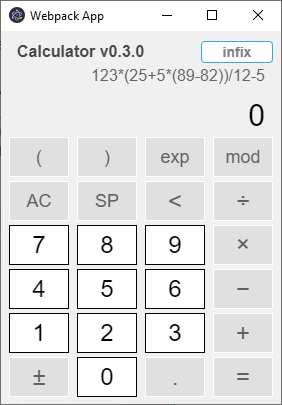
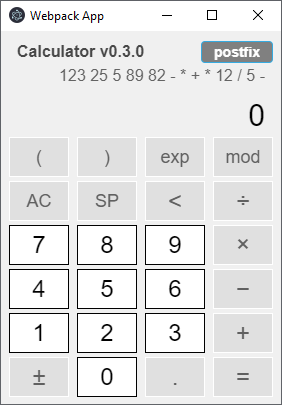

# electron-react-redux-calculator
Calculator app written in Electron with React and Redux.  
* **dual mode** supports transformation between infix and postfix expression  
<table align="center">
<tr>
<td align="center"><h4>INFIX mode</h4></td>
<td align="center"><h4>POSTFIX mode</h4></td>
</tr>
<tr>
<td></td>
<td></td>
</table>

## Table of contents

* [Install](#install)
* [Usage](#usage)
* [References](#references)
* [License](#license)

---  

### Install

#### Clone this repo

```bash
~$ git clone https://github.com/jaeyp/electron-react-redux-calculator
```

#### Install dependencies

```bash
~$ npm install
```

---  

### Usage

#### Run the app

```bash
~$ npm run start
```

#### Build the app (automatic)

```bash
~$ npm run package
```

#### Build the app (manual)

```bash
~$ npm run build
```

#### Test the app (after `npm run build`)

```bash
~$ npm run prod
```

---  

### References
* **[webpack boilerplate](https://github.com/jaeyp/electron-react-redux-sass-webpack-boilerplate):** electron-react-redux-sass-webpack-boilerplate   
* **[old-version calculator](https://github.com/jaeyp/react-redux-calculator):** check code history here, but old-version doesn't support webpack  

---  

### License

MIT © [Jaehyun Park](https://portfolio.jaeyp.xyz).
